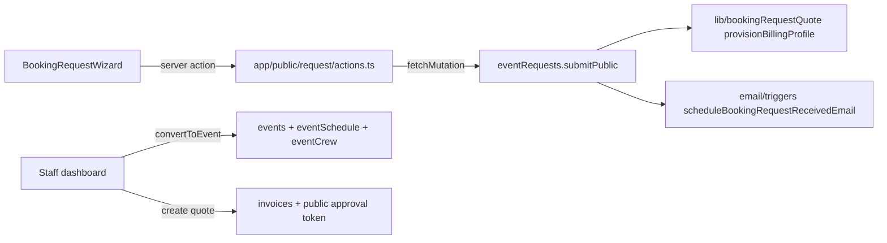

# Architecture

Arbor Live Portal is a pnpm-workspace monorepo for an event production
company: event scheduling and staffing, inventory, invoices/quotes, band
payouts, and a public marketing site.

## Workspace map

```
apps/
  web                  Next.js 16 (App Router) frontend
packages/
  backend              Convex backend + Better Auth (the only stateful service)
  email                @arbor/email — react-email templates + ICS helpers
  format               @arbor/format — shared formatting utilities (dates, money)
  invoice-document     @arbor/invoice-document — invoice/quote document model,
                       web renderer (./web) and PDF renderer (./pdf, @react-pdf/renderer)
```

Dependency direction: `web` depends on `backend` (generated API bindings),
`format`, and `invoice-document`. `backend` depends on `email`, `format`, and
`invoice-document`. Nothing depends on `web`.

## Convex backend (`packages/backend/convex`)

- `schema.ts` — all table definitions and indexes (single file, ~1k lines).
- Codegen: `pnpm --filter backend codegen` regenerates `convex/_generated/`.
  The web app consumes those bindings through `apps/web/src/lib/convex-api.ts`
  (imported as `@/lib/convex-api`). **Always re-run codegen after schema or
  function-signature changes.**
- `crons.ts` — daily schedule reminders, payment-proof reminders, and band
  payment promotion (see `email/reminders.ts`, `email/paymentProofReminders.ts`,
  `bandPayments.ts`).
- `http.ts` + `http/resendInbound.ts` — HTTP router; the only inbound webhook
  is Resend inbound email (svix-verified) used for band-payment confirmation
  replies.
- `migrations/` — one-off data migrations (see the convex-migration-helper
  skill for the process).

### Module tour

| Area | Modules |
|---|---|
| Auth & users | `auth.ts`, `auth.config.ts`, `betterAuth/`, `users.ts`, `userInvites.ts`, `account.ts`, `bootstrap.ts`, `capabilityDefinitions.ts` |
| Events | `events.ts`, `eventSchedule.ts`, `eventCrew.ts`, `eventCrewAvailability.ts`, `eventAssignments.ts`, `eventArtifacts.ts`, `eventExpenses.ts`, `eventPullLists.ts`, `eventSeries.ts`, `eventSeriesPullLists.ts`, `eventBands.ts`, `eventRequests.ts` |
| Invoicing | `invoices.ts`, `invoiceGroups.ts`, `invoiceContacts.ts`, `invoiceTerms.ts`, `invoiceFeeDefinitions.ts`, `invoiceSettings.ts`, `invoicePdf.ts`, `invoicePdfDownload.ts`, `paymentProof*.ts`, `bandPayments.ts` |
| Inventory | `inventoryTypes.ts`, `inventoryItems.ts`, `inventoryCategories.ts`, `inventoryPackages.ts`, `inventoryR2.ts`, `storageLocations.ts`, `lostFoundSettings.ts` |
| Media (Immich) | `immich.ts`, `immichActions.ts`, `immichDb.ts`, `immichEnsure.ts`, `marketingImmich*.ts` |
| Marketing | `marketingDesigns.ts`, `marketingPosts.ts`, `marketingSettings.ts`, `shortLinks.ts`, `marketingInstagram*.ts` |
| Public (unauthenticated) | `publicDirectory.ts`, `publicInventory.ts`, `publicMarketing.ts`, `paymentProofPublic.ts`, `health.ts` |
| Shared helpers | `lib/` (auth guards, booking-quote provisioning, crew cost, Immich client, public tokens, ...) |

## Authentication and authorization

- Better Auth runs *inside* Convex as a component (`convex/betterAuth/`,
  local install). `pnpm auth:generate` regenerates its schema.
- Session identity reaches Convex functions via `ctx.auth.getUserIdentity()`;
  the user record is resolved by email against the Better Auth adapter.
- **All authorization goes through `convex/lib/auth.ts`:**
  - `requireAuth(ctx)` — any signed-in, non-banned user.
  - `requireAdmin(ctx)` — Better Auth admin role.
  - `requireActiveOrganizationContext(ctx)` — resolves the user's active org.
  - `requireArborInternalContext(ctx)` — staff-only (the "Arbor Live" org).
    All event/invoice/inventory operational modules must use this.
  - `requireBandContext(ctx)` — band-org members (band portal surfaces).
- Organizations are Better Auth organizations; `organizationProfiles`
  classifies them as `arbor_internal` or `band`. Band access to event data is
  scoped through `lib/eventBandAccess.ts` (linked events only).
- Public endpoints are either flag-gated (e.g. `publicListing`,
  `showOnPublicCrewPage`, `publicSlug`) or token-gated (quote/request/payment
  tokens — double-UUID secrets stored on the row, looked up by index).
  Public functions must never expose PII beyond what the public page needs.

## Web app (`apps/web/src`)

- `app/` — App Router. Key route groups: `dashboard/` (staff app, auth-gated
  in `dashboard/layout.tsx`), `public/` (booking request wizard, quote view),
  `work/` + `artists/` + `crew/` (marketing site), `e/[assetId]` (lost & found
  QR page), `sign-in`, `accept-invite`, password reset.
- `components/` — feature components grouped by domain (`events/`,
  `financial/`, `inventory/`, `users/`, `marketing/`, `request/`, `ui/` for
  shadcn primitives). **Searchable option lists must use `SearchableSelect`**
  (`components/inventory/searchable-select.tsx`), or a domain wrapper such as
  `EventSelect`, `UserSelect`, or `VenuePicker`. Do not invent ad-hoc searchable
  dropdowns or use native `<select>` for long searchable lists. Schedule-block
  time windows (availability + trainee assign) share
  `ScheduleBlockWindowFields`. User photo / Boring Avatar fallbacks live in
  `components/account/user-avatar.tsx` (stable seed: email → user id → name).
- Data access is Convex live queries (`useQuery`/`useMutation` from
  `convex/react`) in client components; a few server actions use
  `fetchMutation` (e.g. `app/public/request/actions.ts`).
- Validation schemas live in `lib/validations/` (zod), shared between wizard
  steps and server actions.
- Heavy dependencies (FullCalendar, Lexical) are loaded with `next/dynamic`
  at their usage sites — keep it that way when adding new editor/calendar
  surfaces.

## Request flow example (public booking)



## Where to look first

The most detailed working notes live in
`.cursor/skills/arbor-live-portal-app-context/SKILL.md` (domain rules,
UI conventions, known high-risk areas). The human-readable domain overview is
[domain-guide.md](domain-guide.md).
